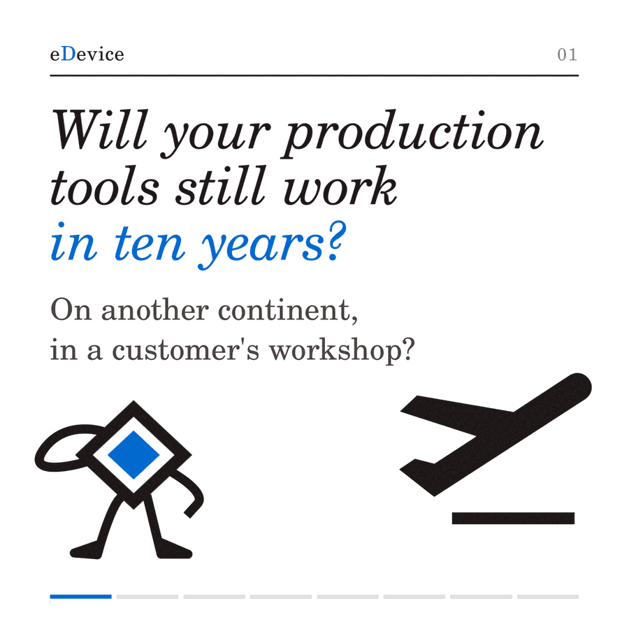
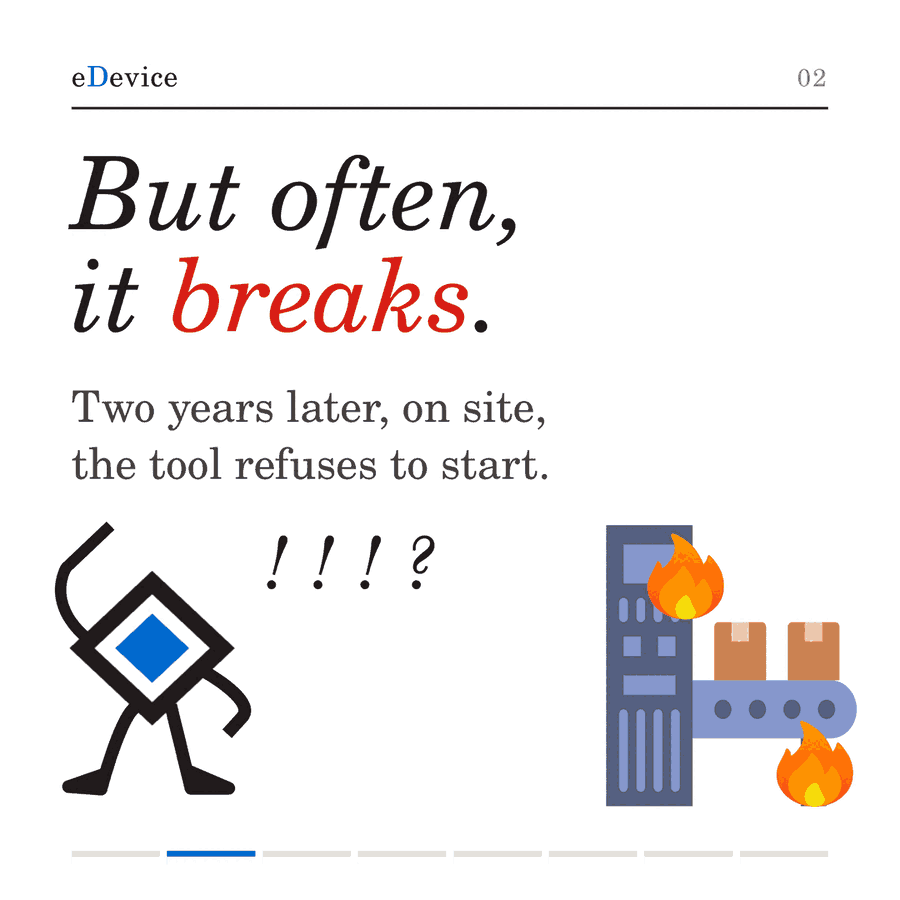
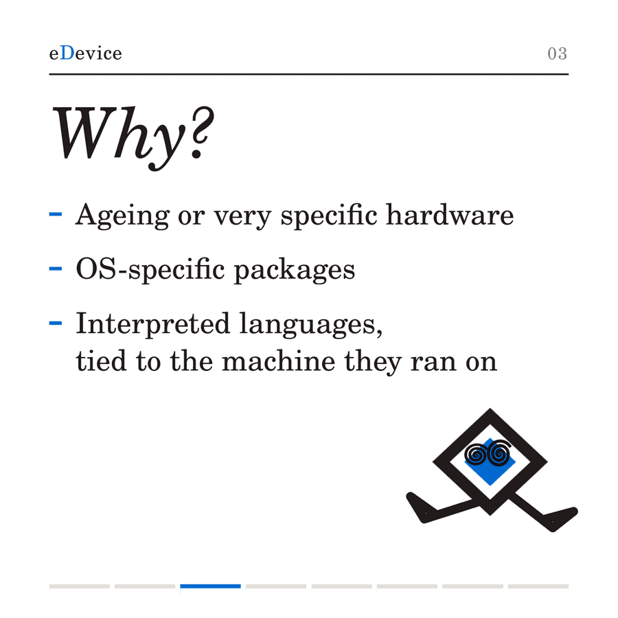
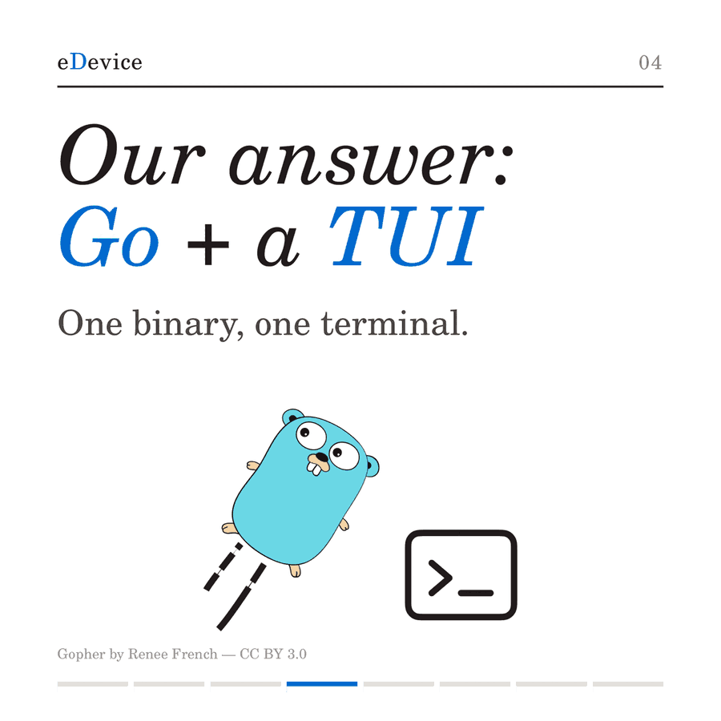
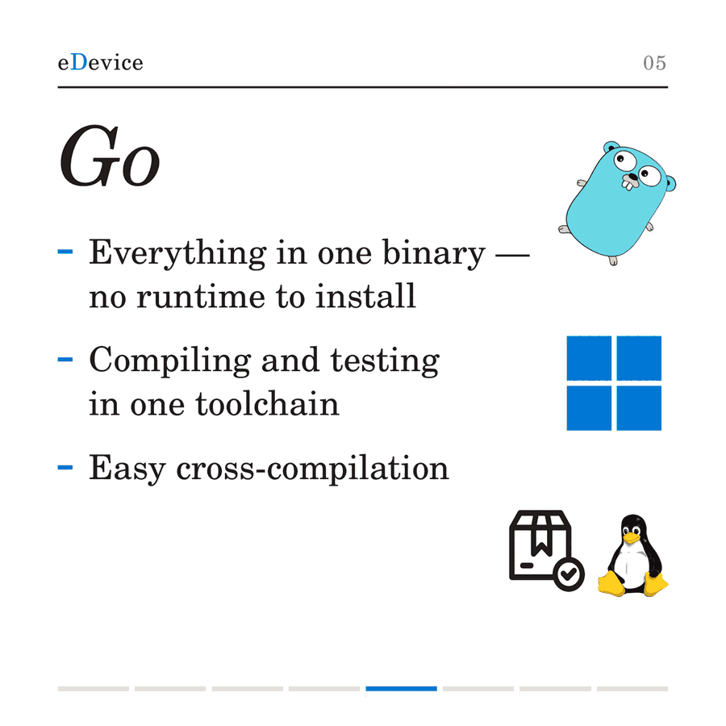
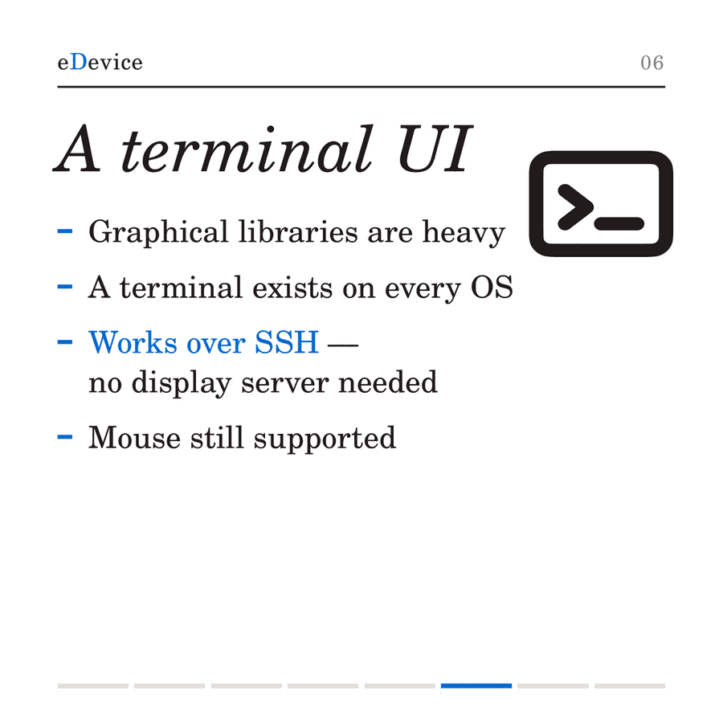
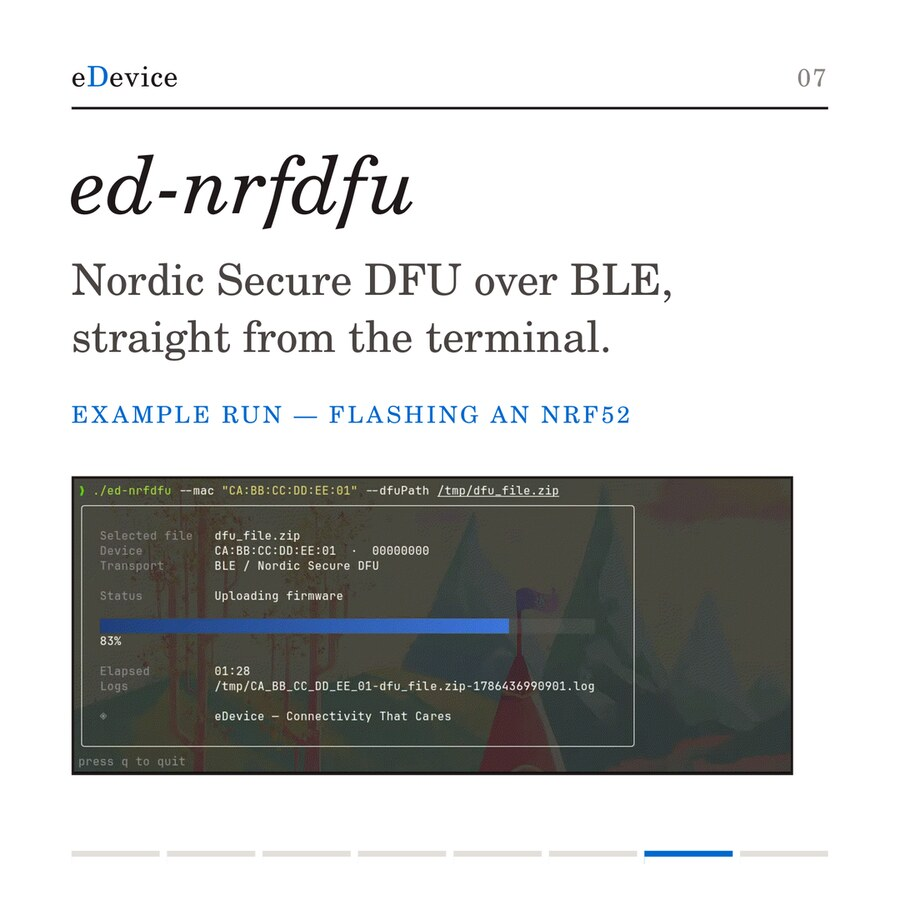
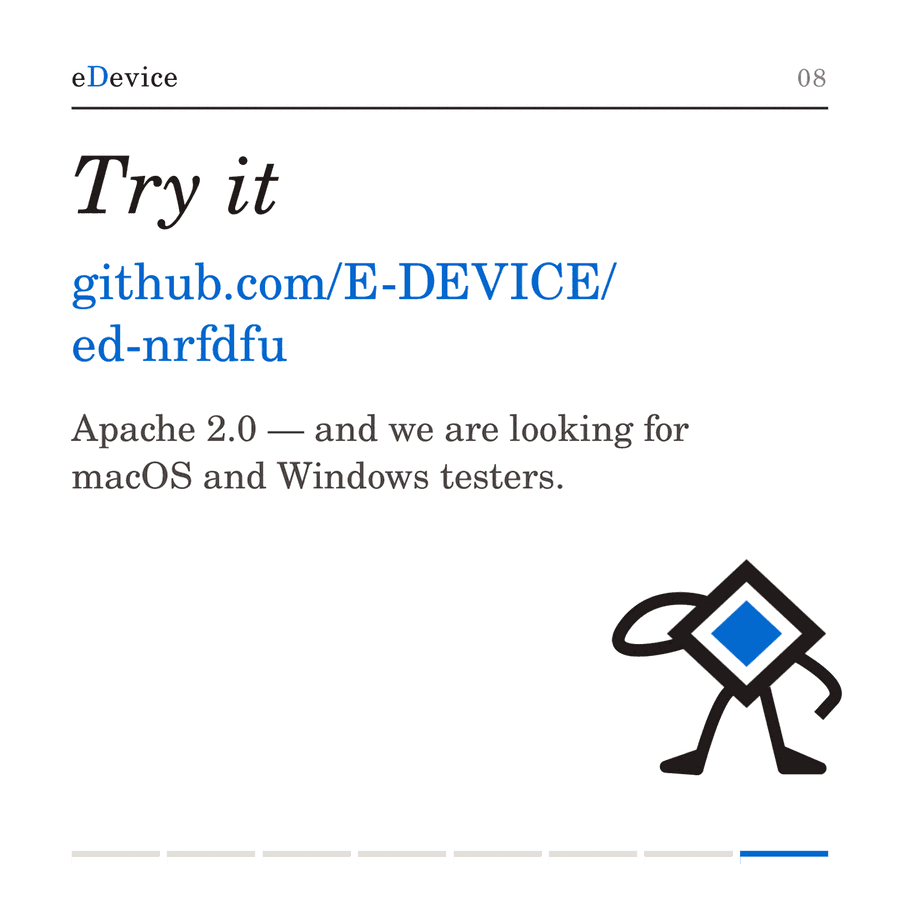

# Go and a TUI for production tooling that lasts

*Engineering notes — eDevice*

A test bench outlives the project that built it. It gets shipped to a customer,
sometimes to another country, and someone will need it to still work in five or
ten years — often without us in the room.

That constraint shapes the tooling more than any feature list. Here is how we
build production and development tools that survive it, and why we settled on Go
with a terminal interface.

---

## The failure we kept seeing

The tool works on the bench where it was written. Two years later, on site, it
does not start.

The reasons repeat:

- **Ageing or very specific hardware**, with drivers that were fine in 2019 and
  are awkward today.
- **OS-specific packages** — the tool needs a runtime, that runtime needs
  libraries, and those libraries were never meant to be installed on a locked-down
  workshop machine with no internet access.
- **Interpreted languages tied to the machine they ran on**. The code is fine.
  The environment around it is gone.

The common thread is not the code. It is everything the code needs *around* it in
order to run.

## One binary, no runtime

Go removes that layer. With `CGO_ENABLED=0`, a Go program links statically: one
file, copied onto the target, executed. No interpreter to install, no system
libraries to line up, nothing to get approved by an IT department that has good
reasons to say no.

This is not a claim that Go magically supports old hardware — drivers and kernel
interfaces are still the operating system's business. What disappears is the
install-time dependency chain, and with it the majority of the field failures
above.

Cross-compilation is a matter of two environment variables, so a single CI runner
produces every target we ship:

```yaml
- { goos: linux,   goarch: amd64, runner: ubuntu-latest, cgo: '0' }
- { goos: linux,   goarch: arm64, runner: ubuntu-latest, cgo: '0' }
- { goos: windows, goarch: amd64, runner: ubuntu-latest, cgo: '0', ext: '.exe' }
- { goos: windows, goarch: arm64, runner: ubuntu-latest, cgo: '0', ext: '.exe' }
```

Four platforms, one Ubuntu machine, no cross-toolchain to maintain.

### Where it stops

macOS breaks the model, and it is worth being precise about it. Reaching
CoreBluetooth means CGO, which means an Xcode SDK, which means an actual macOS
runner. The moment a binding touches a platform framework, the single-runner
story ends.

That is the honest boundary of the approach: Go gives you effortless
cross-compilation right up to the point where you need the host platform's own
frameworks.

## Testing and traceability come with the language

Two things that usually require decisions are simply part of the toolchain:

- `go test -race` — a test runner and a data-race detector, no framework to pick,
  no argument to have.
- `gofmt` — one formatting standard, which ends style discussions permanently.

For traceability, the version, commit and build date are injected into the binary
at link time, so a tool found on a bench years later can say exactly what it is:

```
-ldflags "-X main.version=${TAG} -X main.commit=${GITHUB_SHA} -X main.date=..."
```

Every release ships with a `SHA256SUMS` file alongside the archives. In regulated
environments, being able to prove *which* build is installed is not a nicety.

## Why a terminal interface

Graphical toolkits are heavy: they pull in a dependency tree, they need a display
server, and they reintroduce exactly the install-time fragility we just removed.

A terminal is available on every operating system we target. More importantly, it
**works over SSH with no display server at all** — which is what you want when the
bench is in a workshop on another continent and someone needs you to look at it
now. Modern TUI libraries still support the mouse, so the interface is not
austere; it is just light.

## A concrete example: ed-nrfdfu

[`ed-nrfdfu`](https://github.com/E-DEVICE/ed-nrfdfu) is the tool that came out of
this. It performs Nordic Secure DFU over BLE from a terminal — no phone, no GUI —
so a firmware update can run inside a CI pipeline or an automated test bench.

```bash
go install github.com/E-DEVICE/ed-nrfdfu@latest
ed-nrfdfu --mac "AA:BB:CC:DD:EE:FF" --dfuPath firmware.zip
```

It is published under Apache 2.0. It is a development aid, not a certified
production component — the distinction matters and is spelled out in the
repository.

We are looking for **macOS and Windows testers**: both backends are implemented,
neither is tested on real hardware yet.

## When Go is not the answer

The firmware on the nRF52 itself is C, and stays C. Go tools the host, not the
bare metal. The point is not that one language wins — it is that the constraint
should pick the language. Here the constraint was a decade of deployment on
machines we do not control, and that constraint points at a static binary.

---

## The deck

The same argument as a slide deck.
[Download as PDF](assets/go-tui-deck.pdf).










---

<sub>Gopher by Renee French — CC BY 3.0. Written by the eDevice engineering team —
[edevice.com](https://edevice.com).</sub>
