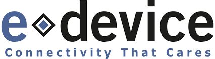

  
   
  Pioneer in end-to-end connectivity since 1999.

Combining telecom, infrastructure, web and embedded systems expertise, we design and build professional **IoT** systems that work anywhere in the world — under **ISO 9001** and **ISO 13485** quality standards.

One partner, one offer:

- **Connectivity** — cellular subscription included, 4G / 5G LTE, running on our own IT infrastructure
- **R&D** — hardware, firmware and software engineered in-house
- **Production & logistics** — from prototype to worldwide delivery
- **Support** — a team that stays with you, all the way

## Applications

- **Industrial maintenance** — equipment monitored in the field, serviced before it fails
- **Retro-fitting** — connectivity added to already installed equipment
- **MVNO** — cellular connectivity operated under your own brand
- **Remote patient monitoring** — medical-grade data, from home to care team

## Products

Not concepts — products in the field:

- **TwoCan Pulse** — an end-to-end solution for the remote monitoring of heart failure patients, reimbursed by the French national health insurance.
- **Wirex** — an ADSL-to-GSM converter, deployed in **over 500,000 units** worldwide.

## Talk with us

A project, a question, an idea? [Let's talk →](https://edevice.com/contact-us/)

